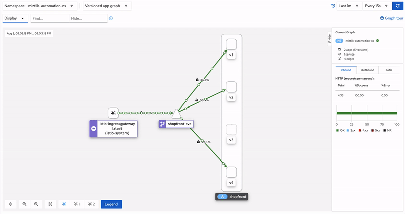
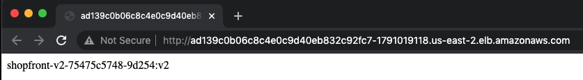
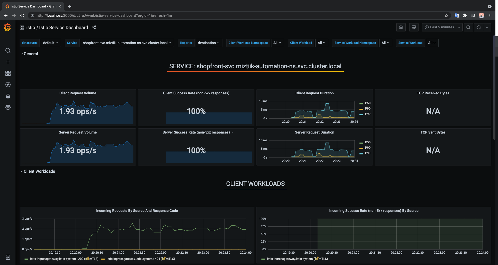
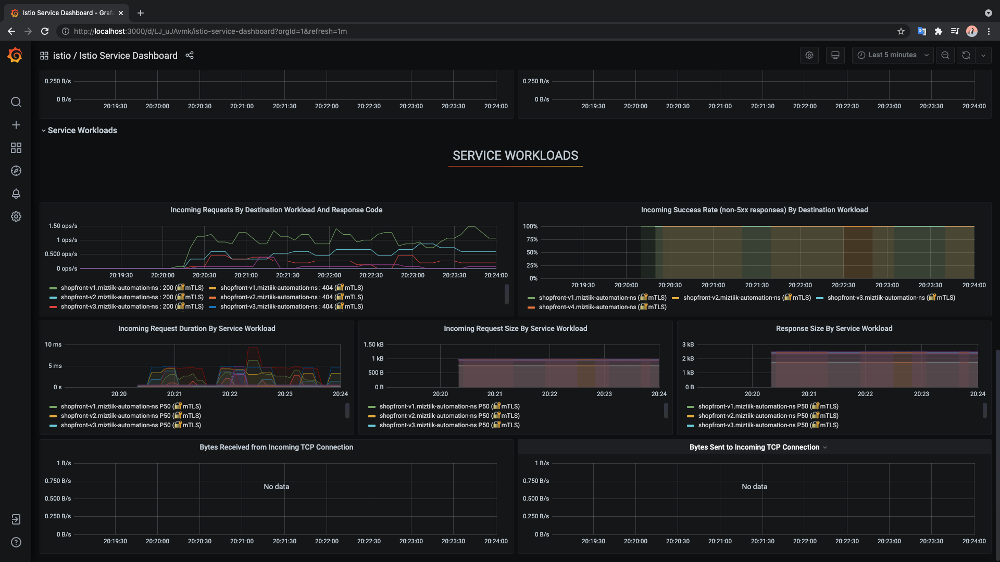
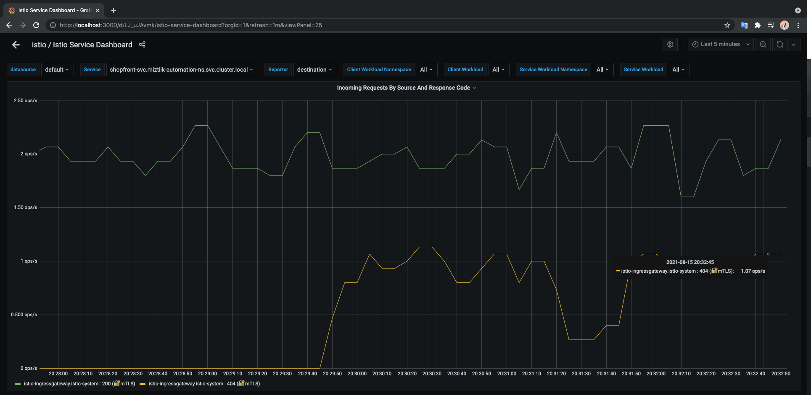
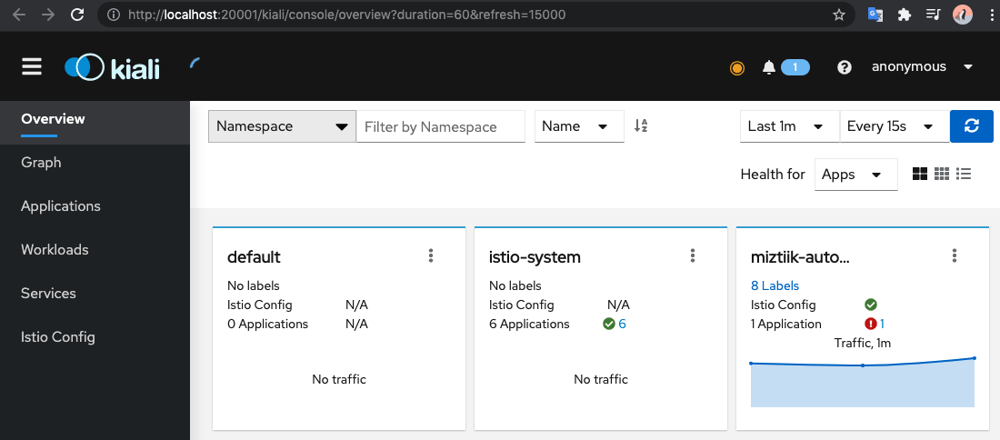
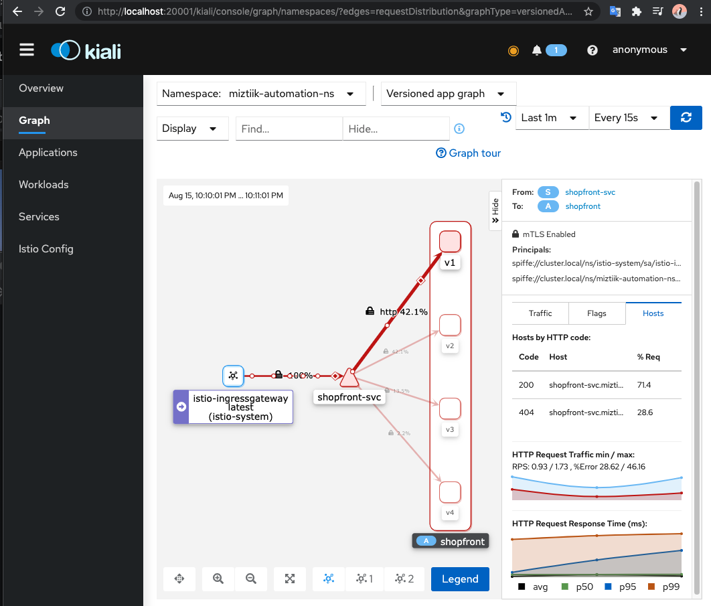

# Kubernetes(EKS) - Service Mesh with Istio

The developer at Mystique Unicorn are interested in building their application using event-driven architectural pattern to process streaming data. For those who are unfamiliar, _An event-driven architecture uses events to trigger and communicate between decoupled services and is common in modern applications built with microservices. An event is a change in state, or an update, like an item being placed in a shopping cart on an e-commerce website._

To maximize efficiency, they would like to have a mechanism to simplify observability, traffic management, security between their microservices. They have heard good things about Isito<sup>[1]</sup>. Can you show them how the can get started with Istio?

## 🎯 Solutions

"Service mesh" is an umbrella term for products that seek to solve the problems that microservices’ architectures create. These challenges include security, network traffic control, and application telemetry. Istio help you to connect services, monitor your application’s network, and control the traffic flow. When an application is running within a service mesh, the application services are run alongside proxies which form the data plane of the mesh. The microservice process executes the business logic and the proxy is responsible for service discovery, observability, network encryption, automatic retries, and traffic shaping. Istio standardizes the way your services communicate, giving you consistent visibility and network traffic controls for all your containerized microservices.

In order to take advantage of all of Istio’s features pods must be running an Istio sidecar proxy. Istio offers two ways injecting the Istio sidecar into a pod:

1. **Manual Injection**: Manually using the `istioctl` command. Manual injection directly modifies configuration, like deployments, and injects the proxy configuration into it.
1. **Automatic Injection**: Automatically using the Istio sidecar injector. We will still need to manually enable Istio in each namespace that we want to be managed by Istio.



In this blog, I will show you how to setup

- A simple web service running `4` different versions of a web page
- Setup Istio for this service and route traffic between the `4` versions in varying amounts
  - We will `enable` istio to automatically inject sidecars to our namespace
- Visualize and observe the traffic flow using Kiali & Grafana

1. ## 🧰 Prerequisites

   This demo, instructions, scripts and cloudformation template is designed to be run in `us-east-1`. With few modifications you can try it out in other regions as well(_Not covered here_).

   - 🛠 AWS CLI Installed & Configured - [Get help here](https://youtu.be/TPyyfmQte0U)
   - 🛠 AWS CDK Installed & Configured - [Get help here](https://www.youtube.com/watch?v=MKwxpszw0Rc)
   - 🛠 Python Packages, _Change the below commands to suit your OS, the following is written for amzn linux 2_
     - Python3 - `yum install -y python3`
     - Python Pip - `yum install -y python-pip`
     - Virtualenv - `pip3 install virtualenv`

1. ## ⚙️ Setting up the environment

   - Get the application code

     ```bash
     git clone https://github.com/miztiik/service-mesh-in-eks
     cd service-mesh-in-eks
     ```

1. ## 🚀 Prepare the dev environment to run AWS CDK

   We will use `cdk` to make our deployments easier. Lets go ahead and install the necessary components.

   ```bash
   # You should have npm pre-installed
   # If you DONT have cdk installed
   npm install -g aws-cdk

   # Make sure you in root directory
   python3 -m venv .venv
   source .venv/bin/activate
   pip3 install -r requirements.txt
   ```

   The very first time you deploy an AWS CDK app into an environment _(account/region)_, you’ll need to install a `bootstrap stack`, Otherwise just go ahead and deploy using `cdk deploy`.

   ```bash
   cdk bootstrap
   cdk ls
   # Follow on screen prompts
   ```

   You should see an output of the available stacks,

   ```bash
    eks-cluster-vpc-stack06
    eks-cluster-stack06
    ssm-agent-installer-daemonset-stack06
   ```

1. ## 🚀 Deploying the application

   Let us walk through each of the stacks,

   - **Stack: eks-cluster-vpc-stack06**
     To host our EKS cluster we need a custom VPC. This stack will build a multi-az VPC with the following attributes,

     - **VPC**:
       - 2-AZ Subnets with Public, Private and Isolated Subnets.
       - 1 NAT GW for internet access from private subnets

     Initiate the deployment with the following command,

     ```bash
     cdk deploy eks-cluster-vpc-stack06
     ```

     After successfully deploying the stack, Check the `Outputs` section of the stack for the

   - **Stack: eks-cluster-stack06**
     As we are starting out a new cluster, we will use most default. No logging is configured or any add-ons. The cluster will have the following attributes,

     - The control pane is launched with public access. _i.e_ the cluster can be access without a bastion host
     - `c_admin` IAM role added to _aws-auth_ configMap to administer the cluster from CLI.
     - One **OnDemand** managed EC2 node group created from a launch template
       - It create two `t3.medium` instances running `Amazon Linux 2`.
       - Auto-scaling Group with `2` desired instances.
       - The nodes will have a node role attached to them with `AmazonSSMManagedInstanceCore` permissions
       - Kubernetes label `app:miztiik_on_demand_ng`

     The EKS cluster will be created in the custom VPC created earlier. Initiate the deployment with the following command,

     ```bash
     cdk deploy eks-cluster-stack06
     ```

     After successfully deploying the stack, Check the `Outputs` section of the stack. You will find the `**ConfigCommand**` that allows yous to interact with your cluster using `kubectl`

   - **Stack: ssm-agent-installer-daemonset-stack06**
     This EKS AMI used in this stack does not include the AWS SSM Agent out of the box. If we ever want to patch or run something remotely on our EKS nodes, this agent is really helpful to automate those tasks. We will deploy a daemonset that will _run exactly once?_ on each node using a cron entry injection that deletes itself after successful execution. If you are interested take a look at the daemonset manifest here `stacks/back_end/eks_cluster_stacks/eks_ssm_daemonset_stack/eks_ssm_daemonset_stack.py`. This is inspired by this AWS guidance.

     Initiate the deployment with the following command,

     ```bash
     cdk deploy ssm-agent-installer-daemonset-stack06
     ```

     After successfully deploying the stack, You can connect to the worker nodes instance using SSM Session Manager.

1. ## 🔬 Testing the solution

   1. **Install Istio in EKS**

      We will follow the excellent instructions from the Istio docs page<sup>[2]</sup>.

      Deploy the manifest,

      ```bash
      # Download the latest version of Istio,
      curl -L https://istio.io/downloadIstio | sh -
      cd istio-1.11.0
      export PATH=$PWD/bin:$PATH
      ```

      Begin Istio Installation,

      ```bash
      istioctl install --set profile=demo -y
      ```

      Expected output,

      ```bash
      istio-1.10.3]# istioctl install --set profile=demo -y
      ✔ Istio core installed
      ✔ Istiod installed
      ✔ Ingress gateways installed
      ✔ Egress gateways installed
      ✔ Installation complete
      ```

      Verify all the services have been installed correctly and running,

      ```bash
      kubectl -n istio-system get svc
      ```

      Expected output,

      ```bash
      NAME                   TYPE           CLUSTER-IP       EXTERNAL-IP                                                               PORT(S)                                                                      AGE
      istio-egressgateway    ClusterIP      172.20.184.115   <none>                                                                    80/TCP,443/TCP                                                               2m19s
      istio-ingressgateway   LoadBalancer   172.20.60.122    ad139c0b06c8c4e0c9d40eb832c92fc7-1791019118.us-east-2.elb.amazonaws.com   15021:31891/TCP,80:32225/TCP,443:32564/TCP,31400:30097/TCP,15443:32448/TCP   2m19s
      istiod                 ClusterIP      172.20.133.255   <none>                                                                    15010/TCP,15012/TCP,443/TCP,15014/TCP                                        2m31s
      ```

      Verify the pods,

      ```bash
      kubectl -n istio-system get pods
      ```

      Expected output,

      ```bash
      NAME                                   READY   STATUS    RESTARTS   AGE
      istio-egressgateway-7bfdcc9d86-lhpsn   1/1     Running   0          3m33s
      istio-ingressgateway-565bffd4d-4k7rn   1/1     Running   0          3m33s
      istiod-5c6d886bd8-7tph6                1/1     Running   0          3m45s
      ```

      Now we are all set to deploy our application.

      1. **Deploy Our Shopfront Application**

      We will be deploying the application in a separate namespace `miztiik-automation-ns`. These manifest files are under `stacks/k8s_utils/manifests/`.

      - The namespace has a label `istio-injection: enabled` that informs istio to manage this namespace. If you already have a namespace you can label them using this command `kubectl label namespace MY-NAMESPACE istio-injection=enabled`
      - For the web services, we will deploy `4` version of webpage. The webpage will be hostname name and a version identifier. For example `shopfront-v2-5db5c98646-gnlql:v2`
        - Three of the deployments will be using the `httpd` container image and `v4` will use `nginx` image. We can later use this variation to check if response from `nginx` is faster than web servers running `httpd`.
        - As we have `4` versions, we can use Istio to shift traffic between them at a later stage, simulating real-life canary deployments.

      ```bash
      kubectl apply -f shopfront.yaml
      ```

      Wait for few minutes and check the deployment status. Let us inspect the pods to see that the Envoy sidecar is present.

      ```bash
      kubectl get svc,pods -n miztiik-automation-ns
      ```

      Expected output,

      ```json
      manifests]# kubectl get svc,pods -n miztiik-automation-ns
      NAME                    TYPE        CLUSTER-IP     EXTERNAL-IP   PORT(S)   AGE
      service/shopfront-svc   ClusterIP   172.20.79.71   <none>        80/TCP    98s

      NAME                                READY   STATUS    RESTARTS   AGE
      pod/shopfront-v1-767b65df8f-57ljf   2/2     Running   0          101s
      pod/shopfront-v1-767b65df8f-68bbq   2/2     Running   0          101s
      pod/shopfront-v1-767b65df8f-lmhnd   2/2     Running   0          101s
      pod/shopfront-v2-75475c5748-9d254   2/2     Running   0          100s
      pod/shopfront-v2-75475c5748-l8zm6   2/2     Running   0          100s
      pod/shopfront-v3-6fc848879-767gh    2/2     Running   0          100s
      pod/shopfront-v4-7b5f4fd975-kn55t   2/2     Running   0          99s
      ```

      We can see that each pod has two containers, one is the website container and another is the istio proxy sidecar.

      You can also check the istio-proxy logs for one of the pods,

      ```bash
      kubectl logs pod/shopfront-v1-767b65df8f-57ljf istio-proxy -n miztiik-automation-n
      ```

      The most important line is the last one, which tells us that the Envoy proxy had been added to the pod and ready to manage traffic.

      ```text
      2021-08-15T11:21:04.449606Z     info    FLAG: --concurrency="2"
      2021-08-15T11:21:04.449658Z     info    FLAG: --domain="miztiik-automation-ns.svc.cluster.local"
      2021-08-15T11:21:04.449665Z     info    FLAG: --help="false"
      2021-08-15T11:21:04.449672Z     info    FLAG: --log_as_json="false"
      2021-08-15T11:21:04.449676Z     info    FLAG: --log_caller=""
      2021-08-15T11:21:04.449680Z     info    FLAG: --log_output_level="default:info"
      2021-08-15T11:21:04.449683Z     info    FLAG: --log_rotate=""
      2021-08-15T11:21:04.449687Z     info    FLAG: --log_rotate_max_age="30"
      2021-08-15T11:21:04.449691Z     info    FLAG: --log_rotate_max_backups="1000"
      2021-08-15T11:21:04.449696Z     info    FLAG: --log_rotate_max_size="104857600"
      2021-08-15T11:21:04.449700Z     info    FLAG: --log_stacktrace_level="default:none"
      2021-08-15T11:21:04.449732Z     info    FLAG: --log_target="[stdout]"
      2021-08-15T11:21:04.449738Z     info    FLAG: --meshConfig="./etc/istio/config/mesh"
      2021-08-15T11:21:04.449742Z     info    FLAG: --outlierLogPath=""
      2021-08-15T11:21:04.449746Z     info    FLAG: --proxyComponentLogLevel="misc:error"
      2021-08-15T11:21:04.449750Z     info    FLAG: --proxyLogLevel="warning"
      2021-08-15T11:21:04.449754Z     info    FLAG: --serviceCluster="shopfront.miztiik-automation-ns"
      2021-08-15T11:21:04.449757Z     info    FLAG: --stsPort="0"
      2021-08-15T11:21:04.449761Z     info    FLAG: --templateFile=""
      2021-08-15T11:21:04.449766Z     info    FLAG: --tokenManagerPlugin="GoogleTokenExchange"
      2021-08-15T11:21:04.449771Z     info    Version 1.10.3-61313778e0b785e401c696f5e92f47af069f96d0-Clean
      2021-08-15T11:21:04.450151Z     info    Proxy role      ips=[10.10.0.84] type=sidecar id=shopfront-v1-767b65df8f-57ljf.miztiik-automation-ns domain=miztiik-automation-ns.svc.cluster.local
      2021-08-15T11:21:04.450249Z     info    Apply proxy config from env {}

      2021-08-15T11:21:04.451988Z     info    Effective config: binaryPath: /usr/local/bin/envoy
      concurrency: 2
      configPath: ./etc/istio/proxy
      controlPlaneAuthPolicy: MUTUAL_TLS
      discoveryAddress: istiod.istio-system.svc:15012
      drainDuration: 45s
      parentShutdownDuration: 60s
      proxyAdminPort: 15000
      serviceCluster: shopfront.miztiik-automation-ns
      statNameLength: 189
      statusPort: 15020
      terminationDrainDuration: 5s
      tracing:
        zipkin:
          address: zipkin.istio-system:9411

      2021-08-15T11:21:04.452006Z     info    JWT policy is third-party-jwt
      2021-08-15T11:21:04.452017Z     info    Pilot SAN: [istiod.istio-system.svc]
      2021-08-15T11:21:04.452022Z     info    CA Endpoint istiod.istio-system.svc:15012, provider Citadel
      2021-08-15T11:21:04.454669Z     info    Using CA istiod.istio-system.svc:15012 cert with certs: var/run/secrets/istio/root-cert.pem
      2021-08-15T11:21:04.454798Z     info    citadelclient   Citadel client using custom root cert: istiod.istio-system.svc:15012
      2021-08-15T11:21:04.546487Z     info    ads     All caches have been synced up in 103.485905ms, marking server ready
      2021-08-15T11:21:04.546762Z     info    sds     SDS server for workload certificates started, listening on "./etc/istio/proxy/SDS"
      2021-08-15T11:21:04.546806Z     info    xdsproxy        Initializing with upstream address "istiod.istio-system.svc:15012" and cluster "Kubernetes"
      2021-08-15T11:21:04.547019Z     info    sds     Start SDS grpc server
      2021-08-15T11:21:04.547071Z     info    Opening status port 15020
      2021-08-15T11:21:04.556683Z     info    Starting proxy agent
      2021-08-15T11:21:04.556710Z     info    Epoch 0 starting
      2021-08-15T11:21:04.562418Z     info    Envoy command: [-c etc/istio/proxy/envoy-rev0.json --restart-epoch 0 --drain-time-s 45 --drain-strategy immediate --parent-shutdown-time-s 60 --service-cluster shopfront.miztiik-automation-ns --service-node sidecar~10.10.0.84~shopfront-v1-767b65df8f-57ljf.miztiik-automation-ns~miztiik-automation-ns.svc.cluster.local --local-address-ip-version v4 --bootstrap-version 3 --disable-hot-restart --log-format %Y-%m-%dT%T.%fZ        %l      envoy %n        %v -l warning --component-log-level misc:error --concurrency 2]
      2021-08-15T11:21:05.044593Z     info    xdsproxy        connected to upstream XDS server: istiod.istio-system.svc:15012
      2021-08-15T11:21:05.169651Z     info    ads     ADS: new connection for node:sidecar~10.10.0.84~shopfront-v1-767b65df8f-57ljf.miztiik-automation-ns~miztiik-automation-ns.svc.cluster.local-1
      2021-08-15T11:21:05.173594Z     info    ads     ADS: new connection for node:sidecar~10.10.0.84~shopfront-v1-767b65df8f-57ljf.miztiik-automation-ns~miztiik-automation-ns.svc.cluster.local-2
      2021-08-15T11:21:05.240232Z     info    cache   generated new workload certificate      latency=693.415473ms ttl=23h59m59.759780376s
      2021-08-15T11:21:05.240276Z     info    cache   Root cert has changed, start rotating root cert
      2021-08-15T11:21:05.240445Z     info    ads     XDS: Incremental Pushing:0 ConnectedEndpoints:2 Version:
      2021-08-15T11:21:05.240631Z     info    cache   returned workload trust anchor from cache       ttl=23h59m59.759375115s
      2021-08-15T11:21:05.240737Z     info    cache   returned workload trust anchor from cache       ttl=23h59m59.759269294s
      2021-08-15T11:21:05.241432Z     info    cache   returned workload certificate from cache        ttl=23h59m59.758577791s
      2021-08-15T11:21:05.241894Z     info    sds     SDS: PUSH       resource=default
      2021-08-15T11:21:05.242189Z     info    sds     SDS: PUSH       resource=ROOTCA
      2021-08-15T11:21:05.244345Z     info    cache   returned workload trust anchor from cache       ttl=23h59m59.755662293s
      2021-08-15T11:21:05.244643Z     info    sds     SDS: PUSH       resource=ROOTCA
      2021-08-15T11:21:06.586325Z     info    Initialization took 2.142425399s
      2021-08-15T11:21:06.586351Z     info    Envoy proxy is ready
      ```

      1. **Create Service Mesh**

      To create a service mesh, we need to let istio know which resources need to route receive traffic in our service. This manifest file are under `stacks/k8s_utils/manifests/shopfront-mesh.yaml` has the necessary configurations. It creates istio gateway, virtual service and destination rules.

      We use the rich traffic routing functionality available in virtual services to add weights to various version in app. For example, this manifest configures istio to send

      - `50` percentage of the traffic to pods labelled as `version:v1`
      - `30` percentage of the traffic to pods labelled as `version:v2`
      - `15` percentage of the traffic to pods labelled as `version:v3`
      - `5` percentage of the traffic to pods labelled as `version:v4`

      Similarly, the destination rules allows to load balance traffic within single version. This is the pod-container setup in our demo app,

      - `version:v1` Pod has `3` containers
      - `version:v2` Pod has `2` containers
      - `version:v3` Pod has `1` containers
      - `version:v4` Pod has `1` containers

      For example, We do not want all the requests going to `v1` to hit the same container. We can use the destination rule load balancer traffic policy to `ROUND_ROBIN` the requests between multiple containers.

      Deploy the service mesh

      ```bash
      kubectl apply -f shopfront-mesh.yaml
      ```

      Expected output,

      ```json
      manifests]# kubectl apply -f shopfront-mesh.yaml
      gateway.networking.istio.io/shopfront-gateway created
      virtualservice.networking.istio.io/shopfront-virtual-service created
      destinationrule.networking.istio.io/shopfront-svc created
      ```

      Confirm our configuration is all good,

      ```bash
      istio-1.10.3]# istioctl analyze -n miztiik-automation-ns
      ✔ No validation issues found when analyzing namespace: miztiik-automation-ns.
      ```

      Now we are all set to check our service.

      1. **Test Service Mesh**

      Get the service url,

      ```bash
      export GATEWAY_URL=$(kubectl -n istio-system get service istio-ingressgateway -o jsonpath='{.status.loadBalancer.ingress[0].hostname}')
      echo $GATEWAY_URL
      ```

      Generate some requests against our service

      ```bash
      curl $GATEWAY_URL
      ```

      Expected Output,

      ```bash
      shopfront-v4-7b5f4fd975-kn55t:v4
      ```

      

      1. **Test Traffic Distribution**

      You can also use a web browser to access the url few times. Each refresh should land you in a different version of the pod. Even if it goes to the same version, the traffic should `ROUND_ROBIN` between different containers. I have written a very simple bash script to count the requests going to different version. The script can be found in the directory `stacks/k8s_utils/manifests/requests_counter.sh`. It will generate `100` against our service and provide a summary,

      ```bash
      sh requests_counter.sh
      ```

      Expected Output,

      ```bash
      Count of v1 requests: 50
      Count of v2 requests: 33
      Count of v3 requests: 14
      Count of v4 requests: 3
      ```

      You can observe that the traffic is following the distribution we configured in our virtual service configuration.

      1. **Test Traffic LoadBalancing**

      We have multiple containers in `v1` and `v2`. In our destination rule, we configured istio to `ROUND_ROBIN` load balance traffic going to `v2`. I have written a simple bash script to count the requests going to individual containers in `v2`. different version. The script can be found in the directory `stacks/k8s_utils/manifests/routing_load_balancer_counter.sh`. It will generate `100` against our service and provides a summary,

      ```bash
      sh routing_load_balancer_counter.sh
      ```

      Expected Output,

      ```bash
      container 1 hostname : shopfront-v2-75475c5748-9d254
      container 2 hostname : shopfront-v2-75475c5748-l8zm6

                    Total requests to v2: 29

      Count of requests to v2 container 1: 15
      Count of requests to v2 container 2: 14
      ```

      You can observe that the traffic is equally distributed between our containers.

      1. **Visualizing Metrics with Grafana**

      Checking out performance of the services using custom scripts is not efficient. Let us explore how to us the prometheus and grafana to explore our services. Once again we will use the documentation from Istio<sup>[3]</sup> and use the pre-built dashboards provided by Istio.

      Navigate to the istio install directory: `istio-1.11.0`>`samples`>`addons`. Here you will find the manifests prometheus and grafana.

      Begin Prometheus and Grafana Installation,

      ```bash
      kubectl apply -f prometheus.yaml
      kubectl apply -f grafana.yaml
      ```

      Confirm the pods and services are running

      ```bash
      addons]# kubectl -n istio-system get svc prometheus
      NAME         TYPE        CLUSTER-IP       EXTERNAL-IP   PORT(S)    AGE
      prometheus   ClusterIP   172.20.155.205   <none>        9090/TCP   44s
      addons]# kubectl -n istio-system get svc grafana
      NAME      TYPE        CLUSTER-IP       EXTERNAL-IP   PORT(S)    AGE
      grafana   ClusterIP   172.20.123.105   <none>        3000/TCP   44s
      ```

      Access the Istio Dashboard via the Grafana UI. (_make sure you are back at the istio binary root directory_)

      ```bash
      istioctl dashboard grafana &
      ```

      It should open a new browser window for `http://localhost:3000/`, if not navigate to `http://localhost:3000/dashboard/db/istio-service-dashboard`. Let us generate some traffic on our service and observe the graphs.

      Initiate Load Generator. The following command will run a container in _default_ namespace and generates `2` requests per sec(`2rps`) against our service.

      ```bash
      export GATEWAY_URL=$(kubectl -n istio-system get service istio-ingressgateway -o jsonpath='{.status.loadBalancer.ingress[0].hostname}')
      kubectl run load-generator --image=busybox --restart=Never -- /bin/sh -c "while sleep 0.5; do wget -q -O- http://$GATEWAY_URL; done"
      ```

      
      

      As you can see, all requests are successful and the traffic is being distributed across different version. Let us request of non existent pages(\_generate some `404` errors and see if we can see them in the dashboard.)

      Initiate Load Generator. The following command will run a container in _default_ namespace and generates `2` requests per sec(`2rps`) against our service.

      ```bash
      export GATEWAY_URL=$(kubectl -n istio-system get service istio-ingressgateway -o jsonpath='{.status.loadBalancer.ingress[0].hostname}')
      kubectl run error-generator --image=busybox --restart=Never -- /bin/sh -c "while sleep 1; do wget -q -O- http://$GATEWAY_URL/miztiik-error-generator; done"
      ```

      Now we see the errors on our page.
      

      1. **Visualizing Your Mesh**

      Checking out performance of the services using custom scripts is not efficient. Let us explore how to us the prometheus and grafana to explore our services. Once again we will use the documentation from Istio<sup>[3]</sup> and use the pre-built dashboards provided by Istio.

      Navigate to the istio install directory: `istio-1.11.0`>`samples`>`addons`. Here you will find the manifests prometheus and grafana.

      Begin Kiali Installation,

      ```bash
      kubectl apply -f kiali.yaml
      ```

      Confirm the pods and services are running

      ```bash
      addons]# kubectl -n istio-system get svc kiali
      NAME    TYPE        CLUSTER-IP       EXTERNAL-IP   PORT(S)              AGE
      kiali   ClusterIP   172.20.182.125   <none>        20001/TCP,9090/TCP   18s
      ```

      Access the Kiali Dashboard. (_make sure you are back at the istio binary root directory_)

      ```bash
      istioctl dashboard kiali &
      ```

      
      

      As we have a error generator running, we are seeing a degraded service in our kiali dashboard.

1. ## 📒 Conclusion

Here we have demonstrated how we can use Istio to create service mesh in our kubernetes cluster. We can be extended to setup circuit breakers to isolate failing services.

1. ## 🧹 CleanUp

If you want to destroy all the resources created by the stack, Execute the below command to delete the stack, or _you can delete the stack from console as well_

- Resources created during [Deploying The Application](#-deploying-the-application)
- Delete CloudWatch Lambda LogGroups
- _Any other custom resources, you have created for this demo_

```bash
# Delete from cdk
cdk destroy

# Follow any on-screen prompts

# Delete the CF Stack, If you used cloudformation to deploy the stack.
aws cloudformation delete-stack \
  --stack-name "MiztiikAutomationStack" \
  --region "${AWS_REGION}"
```

This is not an exhaustive list, please carry out other necessary steps as maybe applicable to your needs.

## 📌 Who is using this

This repository aims to show how to seupt service meshes new developers, Solution Architects & Ops Engineers in AWS. Based on that knowledge these Udemy [course #1][102], [course #2][101] helps you build complete architecture in AWS.

### 💡 Help/Suggestions or 🐛 Bugs

Thank you for your interest in contributing to our project. Whether it is a bug report, new feature, correction, or additional documentation or solutions, we greatly value feedback and contributions from our community. [Start here](/issues)

### 👋 Buy me a coffee

[](https://ko-fi.com/Q5Q41QDGK) Buy me a [coffee ☕][900].

### 📚 References

1. [Istio Docs: Home][1]
1. [Istio Docs: Getting Started][2]
1. [Istio Docs: Visualizing Metrics with Grafana][3]
1. [Kiali Docs: Home][4]

### 🏷️ Metadata


**Level**: 300

[1]: https://istio.io/
[2]: https://istio.io/latest/docs/setup/getting-started/
[3]: https://istio.io/latest/docs/tasks/observability/metrics/using-istio-dashboard/
[4]: https://kiali.io/
[100]: https://www.udemy.com/course/aws-cloud-security/?referralCode=B7F1B6C78B45ADAF77A9
[101]: https://www.udemy.com/course/aws-cloud-security-proactive-way/?referralCode=71DC542AD4481309A441
[102]: https://www.udemy.com/course/aws-cloud-development-kit-from-beginner-to-professional/?referralCode=E15D7FB64E417C547579
[103]: https://www.udemy.com/course/aws-cloudformation-basics?referralCode=93AD3B1530BC871093D6
[899]: https://www.udemy.com/user/n-kumar/
[900]: https://ko-fi.com/miztiik
[901]: https://ko-fi.com/Q5Q41QDGK
